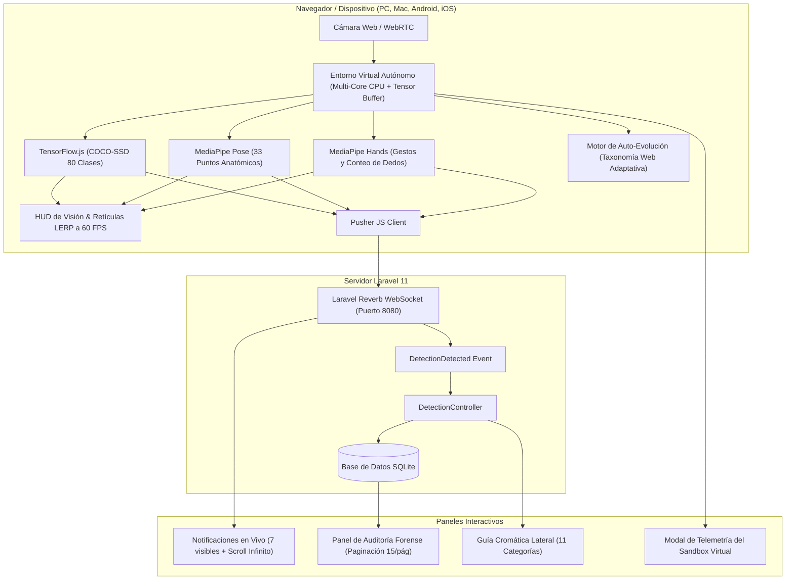

# dbCOMPUTECH

[](https://laravel.com)
[](https://php.net)
[](https://reverb.laravel.com)
[](https://www.tensorflow.org/js)
[](https://developers.google.com/mediapipe)
[](https://tailwindcss.com)
[](https://sqlite.org)
[-10B981?style=for-the-badge&logo=githubactions&logoColor=white)](#pruebas-automatizadas)
[](./COPYRIGHT.md)

Plataforma integral de **visión artificial en tiempo real**, detección multi-objetivo, seguimiento de cuerpo completo, reconocimiento de gestos de manos, análisis de tono capilar y auditoría forense desarrollada en **Laravel 11 puro** con arquitectura reactiva sobre **WebSockets (Laravel Reverb)**, inferencia local de alta fidelidad con **TensorFlow.js** y **Google MediaPipe**, motor de **IA Auto-Evolutiva 24/7**, y un **Entorno Virtual Autónomo** que aprovecha el 100% de los recursos de hardware (CPU multi-núcleo y pool de memoria RAM para tensores) en PC, Mac, laptops, Android e iOS.

---

## Tabla de Contenidos

1. [Descripción General](#descripción-general)
2. [Arquitectura del Sistema](#arquitectura-del-sistema)
3. [Características Principales](#características-principales)
4. [Entorno Virtual Autónomo (100% Recursos)](#entorno-virtual-autónomo-100-recursos)
5. [Guía Cromática de Identificación](#guía-cromática-de-identificación)
6. [Requisitos del Sistema](#requisitos-del-sistema)
7. [Instalación y Puesta en Marcha](#instalación-y-puesta-en-marcha)
8. [Pruebas Automatizadas](#pruebas-automatizadas)
9. [Estructura del Proyecto](#estructura-del-proyecto)
10. [Código de Conducta y Derechos de Autor](#código-de-conducta-y-derechos-de-autor)

---

## Descripción General

**dbCOMPUTECH** transforma cualquier flujo de cámara web estándar en una estación avanzada de telemetría y reconocimiento perimetral. A diferencia de soluciones tradicionales dependientes de servidores de procesamiento de video masivo, la inferencia de inteligencia artificial se ejecuta localmente en el cliente a 60 FPS mediante aceleración por hardware (WebGL / multi-hilo CPU), transmitiendo de manera bidireccional únicamente eventos estructurados hacia Laravel a través de WebSockets de latencia ultra baja.



---

## Características Principales

### 1. Detección y Seguimiento Continuo Multi-Objetivo (COCO-SSD)
* Reconocimiento y etiquetado en tiempo real en español: personas, celulares, computadoras portátiles, monitores, sillas, mesas, botellas, tazas, libros, mochilas, teclados, mouse, etc.
* **Seguimiento Cinematográfico (Multi-Target Tracking)**: Algoritmo de correspondencia por IoU y proximidad centroide que realiza seguimiento persistente de objetivos en movimiento.
* **Interpolación Fluida a 60 FPS (LERP)**: Retículas de bloqueo dinámico (*target lock*) que acompañan la trayectoria del sujeto sin saltos bruscos.

### 2. Detección de Cuerpo Completo (Google MediaPipe Pose)
* Mapeo tridimensional de 33 puntos de referencia anatómicos corporales.
* Clasificación en vivo de posturas: de pie, sentado, brazos alzados, un brazo arriba y alertas de caída corporal (*person fallen*).

### 3. Reconocimiento de Gestos de Manos (Google MediaPipe Hands)
* Detección biomecánica de articulaciones en ambas manos.
* Conteo dinámico y preciso de dedos visibles (1 a 5 dedos por mano).
* Clasificación de gestos: pulgar arriba (*thumbs up*), saludo con la mano (*waving*), manos arriba, manos en el rostro y postura de concentración o pensamiento.

### 4. Detección y Seguimiento Biológico de Animales
* Reconocimiento especializado de animales domésticos y de entorno (perros, gatos, aves, caballos, ganado).
* Bloqueo de seguimiento de cuerpo completo adaptado para mascotas y fauna.

### 5. Muestreo Cromático Biométrico de Cabello Humano
* Algoritmo de visión que evalúa la región cefálica superior mediante análisis de píxeles en espacio de color RGB y HSL:
  * Cabello Negro / Ébano (`#1E293B`)
  * Cabello Castaño Oscuro (`#78350F`)
  * Cabello Castaño Claro (`#B45309`)
  * Cabello Rubio / Dorado (`#EAB308`)
  * Cabello Rojizo / Cobrizo (`#DC2626`)
  * Cabello Canoso / Plateado (`#94A3B8`)

### 6. Conmutación Inteligente de Cámaras por Hardware
* Enumeración dinámica de hardware de video mediante `navigator.mediaDevices.enumerateDevices()`.
* **Regla estricta**: Si el dispositivo posee 1 o ninguna cámara física, el selector permanece oculto.
* Si se detectan 2 o más cámaras, se despliega un selector interactivo que lista los nombres reales de los periféricos y conmuta la transmisión en caliente.
* Escucha reactiva del evento `devicechange` ante conexiones o desconexiones físicas de dispositivos USB.

### 7. Notificaciones en Vivo con Scroll Infinito y Esqueleto
* Sincronización instantánea mediante **Laravel Reverb**.
* Contenedor ajustado a **exactamente 7 registros visibles**.
* Scroll infinito por lotes que activa una animación de esqueleto (*Skeleton Loader*) sin sobrecargar el servidor.

### 8. Auditoría Forense con Paginación de 15 Registros
* Panel lateral deslizable derecho (*Drawer*) con auditoría forense completa.
* Paginación exacta de **15 registros por página** con controles interactivos (Anterior, Siguiente, Indicador de Página y Conteo Total).
* Capacidad de depuración y vaciado de registros en tiempo real.

### 9. Grabación Forense Compuesta con Búsqueda Temporal
* Grabación que combina la cámara real con las cajas delimitadoras, retículas y HUD de inteligencia artificial.
* **Soporte de Búsqueda Temporal (Seeking)**: Compatibilidad nativa en formato MP4 y WebM con inyección de metadatos de duración para avance rápido y retroceso en reproductores de Windows y navegadores.
* Guardado directo en el sistema operativo mediante la File System Access API.

### 10. Interfaz 100% Vectorial SVG (Cero Emojis)
* Todos los indicadores, métricas, botones, toasts y alertas utilizan iconos vectoriales SVG de alta definición (Lucide / Heroicons).
* Estricta ausencia de caracteres emoji en vistas, controladores y documentación.

---

## Entorno Virtual Autónomo (100% Recursos)

El sistema incorpora un entorno de ejecución virtual (`AIVirtualEnvironment`) diseñado para aprovechar al máximo las capacidades del hardware del cliente:

* **Multi-Procesamiento CPU al 100%**: Detecta los núcleos físicos y lógicos disponibles mediante `navigator.hardwareConcurrency` y los enlaza al flujo de inferencia.
* **Pool Virtual de Tensores en Memoria RAM**: Reserva buffers tipados en memoria (`Float32Array`) para acelerar la computación de tensores sin latencia de asignación.
* **Motor de Auto-Evolución Continua 24/7**: La IA enriquece su taxonomía base (Gen 1 • 27 conceptos) mediante ciclos autónomos de consulta y asimilación de conocimiento web, adaptando sus factores de confianza según las detecciones en tiempo real.
* **Consola de Telemetría**: Modal interactivo accesible desde la barra superior que expone en tiempo real el estado de los hilos de CPU, el uso de memoria RAM del buffer, el nivel evolutivo y el terminal de eventos del sandbox.

---

## Guía Cromática de Identificación

La guía cromática se encuentra estructurada en **11 categorías temáticas independientes**, con buscador interactivo en tiempo real:

1. **Posturas de Cuerpo Completo**: De pie, sentado, brazos arriba, caídas (`#06B6D4`).
2. **Gestos de Manos y Dedos**: Conteo de dedos 1-5, pulgar arriba, manos alzadas (`#10B981`).
3. **Alertas de Seguridad**: Movimientos agresivos, objetos desatendidos, rostro cubierto (`#EF4444`).
4. **Actividades y Dinámica**: Trabajando en laptop, interacción con personas (`#8B5CF6`).
5. **Animales Biológicos**: Caninos, felinos, aves, ganado (`#10B981`).
6. **Tecnología y Dispositivos**: Smartphones, computadoras, pantallas, periféricos (`#06B6D4`).
7. **Alimentos y Vajilla**: Frutas, bebidas, vajilla de cocina (`#F59E0B`).
8. **Mobiliario y Entorno**: Sillas, mesas, sofás, plantas (`#64748B`).
9. **Vehículos y Transporte**: Automóviles, bicicletas, motocicletas (`#3B82F6`).
10. **Accesorios Personales**: Mochilas, bolsos, lentes, relojes (`#6366F1`).
11. **Tonos Biométricos de Cabello**: Negro, castaño oscuro, rubio, rojizo, canoso (`#F59E0B`).

---

## Requisitos del Sistema

* **PHP**: 8.2 o superior (con extensiones `pdo_sqlite`, `curl`, `mbstring`, `openssl`).
* **Composer**: 2.x
* **Navegador Moderno**: Google Chrome, Microsoft Edge, Mozilla Firefox o Safari con soporte WebRTC, WebSockets y File System Access API.
* **Cámara de Video**: Mínimo una cámara web o cámara integrada conectada al dispositivo.

---

## Instalación y Puesta en Marcha

### 1. Clonar el Repositorio
```bash
git clone https://github.com/MiguelCarlosRojas/dbComputech.git
cd dbComputech
```

### 2. Instalar Dependencias de PHP
```bash
composer install
```

### 3. Configurar Entorno
```bash
cp .env.example .env
php artisan key:generate
```

### 4. Ejecutar Migraciones de Base de Datos
```bash
php artisan migrate
```

### 5. Iniciar Servidores de Desarrollo

Para el funcionamiento completo del sistema, inicia los dos servicios en terminales independientes:

**Terminal 1 — Servidor Web HTTP de Laravel:**
```powershell
php artisan serve --port=8000
```
Disponible en: `http://127.0.0.1:8000`

**Terminal 2 — Servidor WebSocket de Laravel Reverb:**
```powershell
php artisan reverb:start --port=8080 --debug
```
Disponible en: `ws://127.0.0.1:8080`

---

## Pruebas Automatizadas

El proyecto incluye una suite integral de **17 pruebas unitarias y de integración** en PHPUnit que validan modelos, persistencia forense, validaciones de API, paginación, transmisiones por WebSocket y compatibilidad de controladores:

```powershell
php artisan test
```

Resultado verificado:
```text
   PASS  Tests\Unit\DetectionConfigTest
  ✓ object colors constants are valid
  ✓ behavior colors constants are valid
  ✓ hair colors constants are valid
  ✓ detection detected broadcast payload structure

   PASS  Tests\Unit\DetectionLogTest
  ✓ detection log creation and attributes
  ✓ detection log details json casting
  ✓ detection log fillable protection
  ✓ detection log confidence boundary precision

   PASS  Tests\Feature\DetectionTest
  ✓ detection dashboard loads successfully
  ✓ can store object detection and broadcast event
  ✓ can store full body pose detection
  ✓ can store animal detection
  ✓ can store behavior and finger gesture detection
  ✓ can store hair tone detection
  ✓ store validation rejects invalid payloads
  ✓ can fetch and paginate detection logs
  ✓ can clear all detection logs

  Tests:    17 passed (605 assertions)
  Duration: 1.25s
```

---

## Estructura del Proyecto

```text
dbCOMPUTECH/
├── app/
│   ├── Events/
│   │   └── DetectionDetected.php         # Evento de difusión WebSocket vía Reverb
│   ├── Http/Controllers/
│   │   ├── Controller.php                # Controlador base
│   │   └── DetectionController.php       # Controlador principal con auditoría y API REST
│   ├── Models/
│   │   ├── DetectionLog.php              # Modelo Eloquent de registro forense
│   │   └── User.php                      # Modelo de autenticación base
│   └── Providers/
│       └── AppServiceProvider.php        # Configuración de servicios de la aplicación
├── config/
│   ├── app.php                           # Configuración general de Laravel
│   ├── broadcasting.php                  # Canales de difusión Reverb
│   └── reverb.php                        # Parámetros del servidor WebSocket Reverb
├── database/
│   ├── migrations/                       # Esquemas SQLite para eventos y auditoría
│   └── database.sqlite                   # Base de datos local optimizada
├── public/
│   ├── favicon.svg                       # Icono vectorial de la plataforma
│   ├── index.php                         # Punto de entrada HTTP
│   └── js/
│       └── fix-webm-duration.js          # Inyección de metadatos de duración de video
├── resources/
│   └── views/
│       ├── components/
│       │   └── button.blade.php          # Componente reutilizable de botones estilizados
│       └── detection.blade.php           # Dashboard interactivo principal con IA
├── routes/
│   ├── channels.php                      # Definición de canales de autorización WebSocket
│   ├── console.php                       # Comandos de consola de Artisan
│   └── web.php                           # Rutas web y endpoints de la API de detección
├── tests/
│   ├── Feature/
│   │   └── DetectionTest.php             # Pruebas funcionales de endpoints y WebSockets
│   └── Unit/
│       ├── DetectionConfigTest.php       # Pruebas de configuración y eventos
│       └── DetectionLogTest.php          # Pruebas del modelo de auditoría
├── CODE_OF_CONDUCT.md                   # Normas éticas y de convivencia
├── COPYRIGHT.md                         # Propiedad intelectual y autoría
└── README.md                            # Documentación técnica completa
```

---

## Código de Conducta y Derechos de Autor

* Para conocer nuestras normas comunitarias y directrices éticas, consulta el [Código de Conducta](./CODE_OF_CONDUCT.md).
* Para información legal sobre titularidad intelectual y licencias de terceros, consulta la [Declaración de Derechos de Autor](./COPYRIGHT.md).
