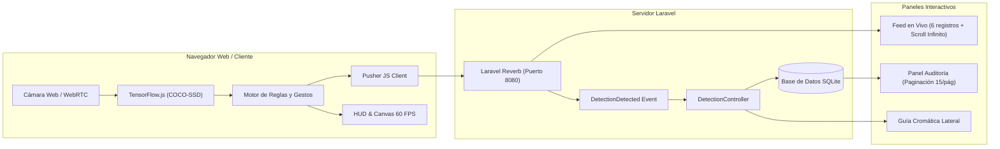

# dbComputech

[](https://laravel.com)
[](https://php.net)
[](https://reverb.laravel.com)
[](https://www.tensorflow.org/js)
[](https://tailwindcss.com)
[](https://sqlite.org)
[](#pruebas-automatizadas)
[](./COPYRIGHT.md)

Plataforma integral de **visión artificial en tiempo real**, análisis de comportamiento humano, detección de entorno y auditoría forense desarrollada en **Laravel 11 puro** con arquitectura reactiva sobre **WebSockets (Laravel Reverb)**, modelos de inferencia local en navegador con **TensorFlow.js**, interfaz de alta precisión sin emojis, y diseño responsivo adaptativo para PC, laptop, tablet y móvil.

---

## Tabla de Contenidos

1. [Descripción General](#descripción-general)
2. [Arquitectura del Sistema](#arquitectura-del-sistema)
3. [Características Principales](#características-principales)
4. [Guía Cromática de Identificación](#guía-cromática-de-identificación)
5. [Requisitos del Sistema](#requisitos-del-sistema)
6. [Instalación y Puesta en Marcha](#instalación-y-puesta-en-marcha)
7. [Pruebas Automatizadas](#pruebas-automatizadas)
8. [Estructura del Proyecto](#estructura-del-proyecto)
9. [Código de Conducta y Derechos de Autor](#código-de-conducta-y-derechos-de-autor)

---

## Descripción General

**dbComputech** transforma cualquier cámara web estándar en una estación de telemetría y reconocimiento perimetral. A diferencia de soluciones tradicionales dependientes de servidores de video pesado, la inferencia de inteligencia artificial se ejecuta localmente en la GPU/WebGL del cliente a 60 FPS sin saturar la red, transmitiendo exclusivamente cargas útiles estructuradas hacia Laravel a través de WebSockets de latencia ultrabaja.



---

## Características Principales

### 1. Detección de Entorno y Objetos (80 Clases COCO-SSD)
* Reconocimiento y etiquetado en tiempo real en español: personas, celulares, laptops, monitores, sillas, mesas, botellas, tazas, libros, mochilas, teclados, mouse, etc.
* Umbral de confianza adaptativo optimizado para identificar elementos en primer plano y en el fondo lejano.
* Cajas delimitadoras (*bounding boxes*) vectoriales con renderizado GPU directo en `<canvas>`.

### 2. Detección Multi-Persona y Comportamiento Grupal
* Seguimiento de presencia individual y conteo de personas en escena.
* Detección de interacción grupal cuando dos o más individuos entran en el encuadre.

### 3. Muestreo Cromático de Cabello Humano (Pixel RGB/HSL)
* Algoritmo de visión que evalúa la región superior de la cabeza mediante muestreo de píxeles:
  * Cabello Negro / Ébano (`#1E293B`)
  * Cabello Castaño Oscuro (`#78350F`)
  * Cabello Castaño Claro (`#B45309`)
  * Cabello Rubio / Dorado (`#EAB308`)
  * Cabello Rojizo / Cobrizo (`#DC2626`)
  * Cabello Canoso / Plateado (`#94A3B8`)

### 4. Reconocimiento de Gestos y Actividad
* Detección de celular al oído (hablando por teléfono).
* Postura de alerta o brazos arriba (*hands up*).
* Gesto de saludo con la mano (*waving*).
* Interacción laboral con laptop o computadora.

### 5. Botón Inteligente de Cambio de Cámara por Hardware
* Detección dinámica de hardware de video mediante `navigator.mediaDevices.enumerateDevices()`.
* **Regla estricta**: Si el dispositivo cuenta con 0 o 1 cámara, el botón permanece **oculto**.
* Si se conectan 2 o más cámaras, el botón aparece con un menú interactivo desplegable que lista cada cámara por su nombre real y conmuta la transmisión en caliente.
* Escucha reactiva del evento `devicechange` para detectar conexión o desconexión física de cámaras USB.

### 6. Notificaciones WebSocket con Scroll Infinito y Esqueleto
* Transmisión bidireccional instantánea mediante **Laravel Reverb**.
* Contenedor ajustado a **exactamente 6 registros visibles**.
* Scroll infinito por lotes que activa una animación de esqueleto (*Skeleton Loader*) sin sobrecargar el servidor ni descargar registros de golpe.
* El esqueleto permanece estrictamente oculto cuando el feed se encuentra en estado vacío.

### 7. Auditoría y Registro en Base de Datos con Paginación de 15 Registros
* Panel lateral deslizable derecho (*Drawer*) con auditoría forense completa.
* Paginación exacta de **15 registros por página** con controles interactivos (Anterior, Siguiente, Indicador de Página y Conteo Total).
* Capacidad de depuración y vaciado de registros en tiempo real.

### 8. Centro de Permisos de Windows y Almacenamiento Local
* Flujo de autorización para captura de pantalla fotográfica instantánea en PNG.
* Grabación de video en tiempo real en formato WebM con temporizador HUD.
* Guardado directo en carpetas del sistema operativo mediante la File System Access API de Windows.

### 9. 100% Vectores SVG y Cero Emojis
* Todos los indicadores, métricas, botones, toasts y alertas utilizan iconos vectoriales SVG de alta definición (Lucide / Heroicons).
* Ningún carácter emoji en vistas, controladores ni documentación.

---

## Guía Cromática de Identificación

Cada categoría de objeto, gesto y tonalidad capilar cuenta con una codificación hexadecimal exclusiva:

| Categoría | Elemento / Evento | Código Hexadecimal | Color Representativo |
| :--- | :--- | :--- | :--- |
| **Objeto** | Persona | `#3B82F6` | Azul Eléctrico |
| **Objeto** | Teléfono Celular | `#F59E0B` | Ámbar Brillante |
| **Objeto** | Laptop / Computadora | `#10B981` | Verde Esmeralda |
| **Objeto** | Botella de Agua | `#8B5CF6` | Púrpura |
| **Objeto** | Taza / Vaso | `#14B8A6` | Turquesa |
| **Objeto** | Silla / Asiento | `#64748B` | Gris Pizarra |
| **Objeto** | Planta Decorativa | `#22C55E` | Verde |
| **Gesto** | Gesto: Manos Arriba / Alerta | `#DC2626` | Rojo Carmesí |
| **Gesto** | Gesto: Saludando con la Mano | `#F59E0B` | Ámbar |
| **Comportamiento** | Persona Atenta / Presente | `#2563EB` | Azul Real |
| **Comportamiento** | Trabajando en Computadora | `#059669` | Verde Bosque |
| **Comportamiento** | Múltiples Personas en Escena | `#6366F1` | Índigo |
| **Cabello** | Cabello Negro / Ébano | `#1E293B` | Ébano |
| **Cabello** | Cabello Castaño Oscuro | `#78350F` | Castaño |
| **Cabello** | Cabello Rubio / Dorado | `#EAB308` | Dorado |
| **Cabello** | Cabello Canoso / Plateado | `#94A3B8` | Plateado |

---

## Requisitos del Sistema

* **PHP**: 8.2 o superior (con extensiones `pdo_sqlite`, `curl`, `mbstring`, `openssl`).
* **Composer**: 2.x
* **Navegador Moderno**: Google Chrome, Microsoft Edge, Mozilla Firefox o Brave con soporte para WebRTC y WebSockets.
* **Cámara Web**: Mínimo una cámara web conectada (integrada o USB).

---

## Instalación y Puesta en Marcha

### 1. Clonar el Repositorio
```bash
git clone https://github.com/MiguelCarlosRojas/dbComputech.git
cd dbComputech
```

### 2. Instalar Dependencias de PHP
```bash
composer install
```

### 3. Configurar Entorno
```bash
cp .env.example .env
php artisan key:generate
```

### 4. Ejecutar Migraciones de Base de Datos
```bash
php artisan migrate
```

### 5. Iniciar Servidores de Desarrollo

Para el funcionamiento completo del sistema, inicia los dos servicios en terminales independientes:

**Terminal 1 — Servidor Web HTTP de Laravel:**
```powershell
php artisan serve --port=8000
```
Disponible en: `http://127.0.0.1:8000`

**Terminal 2 — Servidor WebSocket de Laravel Reverb:**
```powershell
php artisan reverb:start --port=8080 --debug
```
Disponible en: `ws://127.0.0.1:8080`

---

## Pruebas Automatizadas

El proyecto incluye una suite completa de pruebas unitarias y de integración que validan rutas, persistencia en base de datos, paginación y difusión de eventos:

```powershell
php artisan test
```

Resultado verificado:
```text
PASS  Tests\Unit\ExampleTest
✓ that true is true

PASS  Tests\Feature\DetectionTest
✓ detection dashboard loads successfully
✓ can store object detection and broadcast event
✓ can store behavior detection
✓ can store hair tone and gesture detection
✓ can fetch and clear detection logs

PASS  Tests\Feature\ExampleTest
✓ the application returns a successful response

Tests:    7 passed (21 assertions)
```

---

## Estructura del Proyecto

```text
dbComputech/
├── app/
│   ├── Events/
│   │   └── DetectionDetected.php         # Evento de transmisión WebSocket
│   ├── Http/Controllers/
│   │   └── DetectionController.php       # Controlador principal con paginación
│   └── Models/
│       └── DetectionLog.php              # Modelo Eloquent con auditoría
├── config/
│   └── reverb.php                        # Configuración del servidor WebSocket
├── database/
│   └── migrations/                       # Esquema SQLite para eventos y auditoría
├── resources/
│   └── views/
│       ├── components/
│       │   └── button.blade.php          # Componente reutilizable de botones
│       └── detection.blade.php           # Dashboard interactivo principal
├── tests/
│   └── Feature/
│       └── DetectionTest.php             # Suite de pruebas automatizadas
├── CODE_OF_CONDUCT.md                   # Normas de convivencia comunitaria
├── COPYRIGHT.md                         # Propiedad intelectual y autoría
└── README.md                            # Documentación técnica del proyecto
```

---

## Código de Conducta y Derechos de Autor

* Para conocer nuestras normas comunitarias, consulta el [Código de Conducta](./CODE_OF_CONDUCT.md).
* Para información legal sobre titularidad y licencias, consulta la [Declaración de Derechos de Autor](./COPYRIGHT.md).
